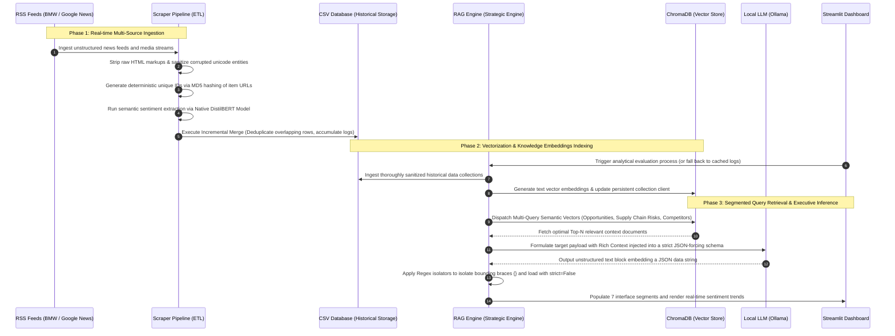

#  BMW AI CEO Agent - Strategic Intelligence System

This repository contains the full production-ready implementation of an AI-powered Strategic Intelligence System tailored for the Executive Board and the CEO of the BMW Group. The system automatically ingests, processes, and analyzes real-time multi-source market and financial data, extracts semantic sentiments, and leverages a localized Retrieval-Augmented Generation (RAG) framework to deliver deep corporate insights and actionable boardroom directives backed by granular evidence.

---

## 1. System Architecture

The pipeline is built upon a modular, decoupled multi-tier architecture to isolate real-time Data Ingestion/ETL, Knowledge Vector Storage, and LLM-powered Reasoning Engine workflows.

```mermaid
graph TD
    subgraph Data Ingestion & ETL Tier
        RSS[Public RSS Feeds Sources] -->|Raw Data Streams| SP[scraper_pipeline.py]
        SP -->|Data Ingestion Shielding & Sentiment Ingestion| CSV[(bmw_live_data.csv)]
    end

    subgraph Knowledge Repository Tier
        CSV -->|Read Persistent Storage| RE[rag_engine.py]
        RE -->|all-MiniLM-L6-v2 Embeddings| CDB[(ChromaDB Vector Store)]
    end

    subgraph Core Reasoning & Executive Interface Tier
        CDB -->|Multi-Query Semantic Context Search| RE
        RE -->|Structured JSON Prompt + Context Injections| LLM[Ollama Local: Gemma 3 (4B)]
        LLM -->|Raw JSON Text Block| RE
        RE -->|Regex Text Sanitizer & Strict Parse Guard| CACHE[bmw_cached_report.json]
        CACHE -->|Sub-second Fast Load Interface Optimization| APP[app.py - Streamlit Dashboard]
        APP -->|Force Cache Eviction Mechanism| RE
    end

    style RSS fill:#f9f,stroke:#333,stroke-width:2px
    style CSV fill:#bbf,stroke:#333,stroke-width:2px
    style CDB fill:#bfb,stroke:#333,stroke-width:2px
    style LLM fill:#ffb,stroke:#333,stroke-width:2px
    style APP fill:#fbb,stroke:#333,stroke-width:2px
```

---

## 2. Data Flow Diagram

The comprehensive end-to-end data lifecycle covers raw, unstructured web scraping pipelines to structured data processing and eventual translation into executive board metrics.



---

## 3. Technology Stack

The infrastructure fully satisfies the strict project requirements of using open-source, non-commercial, localized AI architectures:

* **Core Reasoning Engine:** `Gemma 3 (4B)` hosted locally via Ollama.
* **Vector Embedding Model:** `SentenceTransformers (all-MiniLM-L6-v2)` – Delivering exceptional speed and dense semantic mapping.
* **Knowledge Repository Database:** `ChromaDB (Persistent Client)` – High-performance embedded vector storage to preserve cross-session indices.
* **Sentiment Classifier:** `DistilBERT (distilbert-base-uncased-finetuned-sst-2-english)` via HuggingFace Transformers, integrated with native token truncation guards fixed at a 512-token limit.
* **Data Aggregation Utilities:** `Feedparser` paired with highly customized `Regex Text Cleaners` for comprehensive data extraction.
* **Executive Presentation Tier:** `Streamlit Framework` – Engineered to provide sub-second load times and advanced data visualizations for corporate decision-makers.

---

## 4. AI Engineering Pipeline

The system operates a continuous data processing cycle broken down into four foundational stages:

1. **Text Sanitization & Identity Mapping:** Eradicates messy web tags, metadata, and cross-site scripts. The pipeline enforces deterministic token assignments using `MD5 hashes` derived from the source URL. This guarantees zero duplicate mutations in historical analytical tracking.
2. **Quantitative Sentiment Profiling:** Dynamically weights contextual fragments to assign positive or negative polarity values. This allows the executive board to evaluate brand health, competitor shifts, and public reception in real time.
3. **Contextual Multi-Query RAG:** Rather than firing a generalized query string which reduces similarity matches, the system splits semantic context retrieval into targeted vector segments: Opportunities, Strategic supply chain vulnerabilities, and Competitor maneuvers (e.g., Tesla, Mercedes, Audi). These independent segments are then consolidated to provide highly enriched, hyper-focused context payloads to the LLM.
4. **JSON Enforcement & Grammar Shielding:** Deploys a regex isolation layer `r"\{.*\}"` to capture JSON blocks out of the LLM's conversational text return. The extracted string is parsed using `json.loads(..., strict=False)` to prevent structural crashes caused by system-generated newline characters or tab blocks.

---

## 5. Key Architecture Design Decisions

* **Persistent Incremental Merge System:** Implements an advanced append-and-merge logic within `bmw_live_data.csv`. This continuously enriches the internal database over time, safely tracking historical trend lines regardless of real-time feed expirations (overcoming the standard 48-hour RSS expiration limit) to maintain the mandatory 100+ document base.
* **Strategic Memory Caching Tier:** Analytical LLM reports are written to `bmw_cached_report.json` to enable instantaneous UI updates (0.01s response latency). Executive users can manually bypass this cache and force a complete end-to-end live regeneration from the sidebar.
* **Memory Segmentation Protection (Token Truncation):** Enforces a `TOKENIZERS_PARALLELISM=false` variable setting paired with hard truncation bounds on HuggingFace transformers to prevent runtime segmentation faults across cross-platform architectures.
